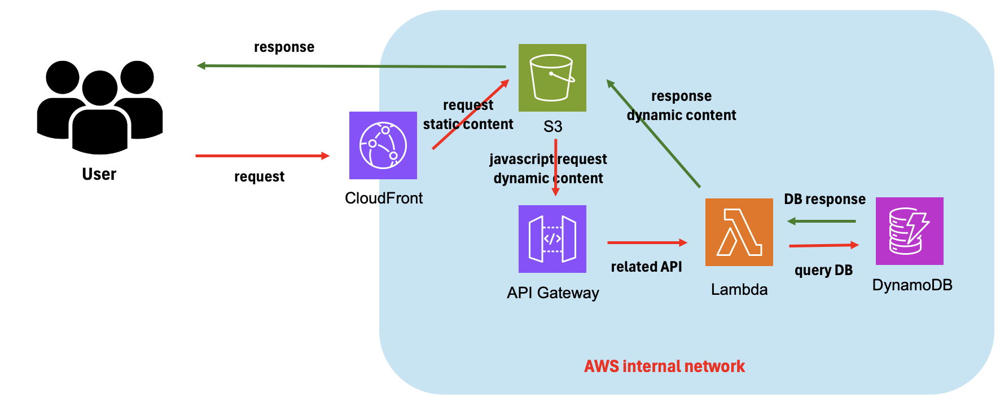
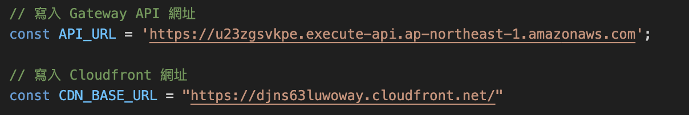
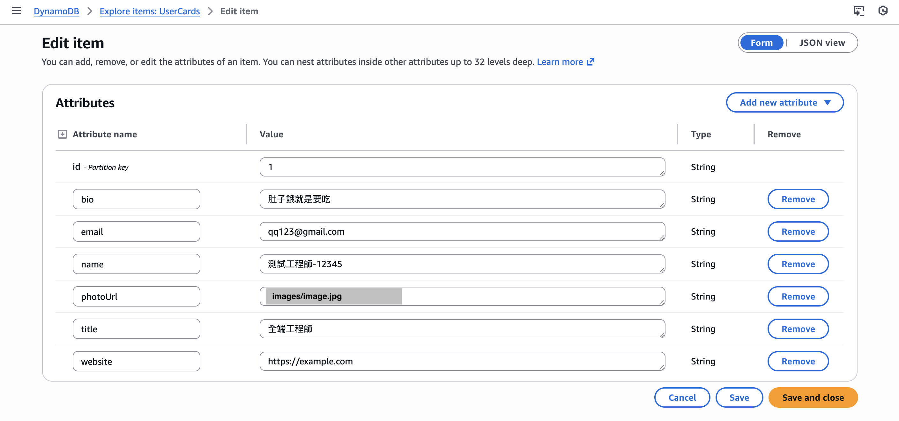
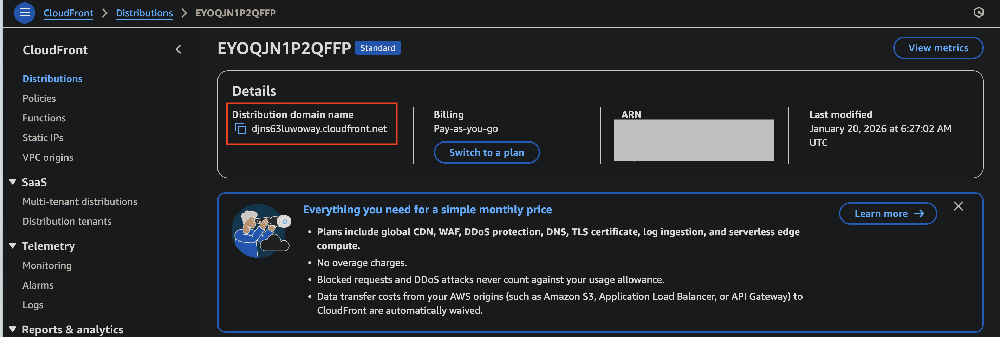
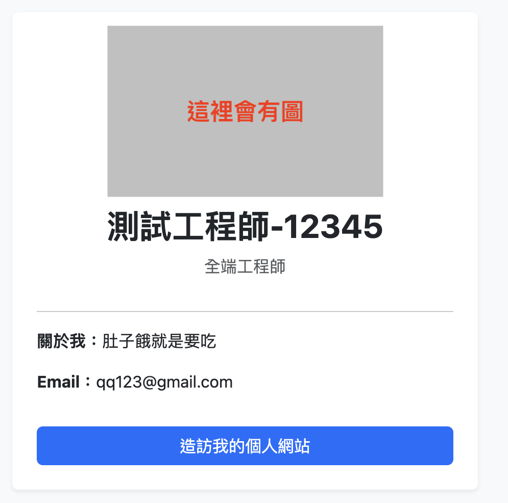
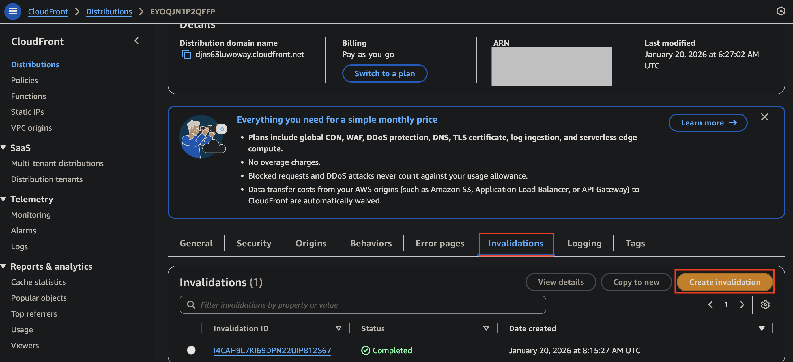

## AWS mini-project
個人名片系統，但只是拿來測 Cloudfront 的快取

## Architecture
應用會是 Frontend, Backend, DB

加上 Cloudfront 來防止直接進到 s3 查看圖片



## How to install

1. git clone 專案到本地

2. 建立 build 資料夾，要與 backend, frontend, terraform 同一層

3. 建立 requirements.txt，這裡直接用 uv 環境建立
    ```
    cd backend
    uv export --format requirements.txt > requirements.txt
    ```

4. 將 backend 所需要的套件先打包到 build 資料夾, 以利後續 terraform 的 lambda 使用
    ```
    pip install \
        --platform manylinux2014_x86_64 \
        --target build/ \
        --implementation cp \
        --python-version 3.12 \
        --only-binary=:all: \
        --upgrade \
        -r backend/requirements.txt
    ```

5. 確認自己的 aws configure 已經準備完成

    接著要操作的項目有建立 s3, dynamoDB, cloufront, api-gateway, lambda, iam-role

6. 進入 terraform 資料夾，運行指令

    ```
    cd terraform

    # terraform 3 步驟
    terraform init
    terraform plan
    terraform apply
    ```

    建立的過程會久一點，因為有 cloudfront 要部建

    然後 output.tf 會產生對應值，這邊要記起來

7. 變更 script.js 中的網址

    由於這是一個驗證的專案，所以沒有考慮業務邏輯，很多網址是給明碼的

    這邊要設定 Gateway API 及 Cloudfront 提供的網址

    


8. s3 上傳圖片，這邊放到 images 資料夾下

    ```
    aws s3 cp image.jpg s3://my-card-project-assets-<random_id>/images/image.jpg
    ```

9. 建立 DynamoDB 假資料

    因為扣是直接寫 id 為 1 的 user，所以建立時要寫 id = 1，之後才能開始寫

    

10. 把 index.html, script.js 上傳至 s3

    ```
    aws s3 cp frontend/index.html s3://my-card-project-<random_id>/index.html
    aws s3 cp frontend/script.js s3://my-card-project-<random_id>/script.js
    ```

11. 輸入 cloudfront 提供的網址，並連到 index.html 即可

    網址: https://<Cloudfront_URL>/index.html

    

    

## Verification

要驗證 cloudfront 的快取功能，在建立 cloudfront 時已經有把快取時間加入了

所以接下來要做的是上傳一個相同名字的圖片，觀察快取何時刷新

```
# 複製另一張同名，但是內容不同的圖片至 s3
aws s3 cp image.jpg s3://my-card-project-assets-<random_id>/images/image.jpg
```

上傳後會發現快取會存在，但這會是問題，所以會用幾種方法解決

- 用 invalidation 清掉快取，但是手動作業

    

- 開啟 s3 versioning，新圖片存同名字帶新版本，然後更新 dynamoDB 存的 photoUrl

